# Bicycle helmet detection using YOLOv8 and OpenCV
_Combine and fine-tune YOLO models to detect if cyclists are wearing a helmet or not._

I created and presented this project to complete my 160-hour Deep Learning bootcamp in April 2024. I then spent some more time improving it until I get convincing results.

https://github.com/alexdjulin/BikeHelmetDetection/assets/53292656/6b7931ba-a585-4a63-814b-6abe569febaf

# Project presentation

Unlike other countries, Germany does not have a strict law regarding bicycle helmets. To this day, it is not compulsory to wear one, but only a recommended safety measure. Unfortunately, many people don't take this measure seriously, which can lead to severe injuries if an accident arises. Especially in a big city like Berlin, cyclist casualties hit the news on a daily bases.

My goal with this project was to raise cyclists awareness, using a friendly and direct feedback method. You may have seen those interactive street signs for cars: If you drive under the speed limit, you get a nice green smiley. But if you drive above it, you get an angry red one instead. Simple but effective. I surprised myself slowing down unconsciously, just for the pleasure to see a smiling face. Who doesn't need one on a Monday morning?

The goal of this project was therefore to train a Deep Learning model to detect on a video source if a cyclist is wearing a helmet or not. Displayed on a traffic light for instance, cyclists would get a direct feedback, in form of a green happy or red angry smiley.

Apart from raising awareness, the model could also be used to count cyclists and collect statistical data.

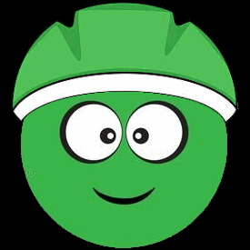


# You Only Look Once
The main reason why I chose this project was to finally get hold of a YOLO model and play around with it. 


If you don't know about YOLO, check [this link](https://blog.roboflow.com/whats-new-in-yolov8/) which goes in-depts about the internal structure and use-cases of the 8th version.

To sup-up, YOLO is an incredible Deep Learning model used to classify, detect, segment or track multiple elements of an image or video in real-time. Widely used everywhere in modern use-cases like healthcare, surveillance, self-driving cars or face detection, you can't set a foot in Computer Vision without hearing about it.


I started browsing through the different versions that [Ultralytics](https://github.com/ultralytics/ultralytics) offers and opted for YOLOv8n, which is the most lightweight version, hoping it would perform well on my old computer. Lightweight but still quite powerful, if you look at the numbers: 225 layers, 3.2M params for an input shape of 640 pixels.

You can chose between different versions, pre-trained on famous datasets:
- Coco (80 classes)
- Open Image v7 (600 classes)
- ImageNet (1000 classes)

# Test a pre-trained model

You will find all my tests and method implementatoin in the *BikeHelmetDetection_Testing* notebook.

I started testing YOLOv8n pre-trained on [Open Image v7](https://storage.googleapis.com/openimages/web/index.html), as it can already detect a person (man, woman), a bicycle and a bicycle helmet.

I loaded the model and ran a prediction on a test image. Looking good!

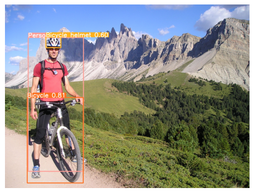

When I tried it on a video file though, the results were not as good as I expected. While the model can classify a person or bicycle prettey accurately, it often fails at detecting the helmet, especially if it's not fully visible or only covers a small part of the picture.

On the other side, I tested the model version pre-trained on the COCO dataset and it seems to do a better job detecting a person and a bicycle. The issue is that there is no helmet class in the COCO dataset...

What if we fine-tune it and teach it how to recognize a helmet? Sounds like fun!

# Fine-Tune a YOLO model

My training steps are available in a [Kaggle](https://www.kaggle.com/code/alexandredj/bikehelmetdetection-yolov8n-training) and [Colab](https://colab.research.google.com/drive/1KGJ68orNqPCK3llccBD6_8MmcEXA1As3) notebooks.

[Training YOLOv8n](https://docs.ultralytics.com/modes/train/) is quite straightforward. The API is cristal clear and you can do that with 3 lines of code. But for those who like to get their hands dirty (like me), you can still access and play around with countless hyperparameters and callbacks.

But regardless how complex your model is, you still need a valuable dataset to train it if you want to get the best out of it.

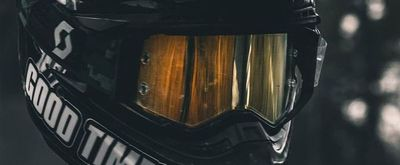

For this project I used the [Helmet Detection](https://www.kaggle.com/datasets/andrewmvd/helmet-detection) dataset on Kaggle. It's not exactly what I need, as it's classifying all kind of driving helmets, also motorbike ones. But let's still give it a try.

- License: CC0: Public Domain
- Content: 764 images and annotations
- 2 classes (with/without helmet)
- Images:  PNGs, various sizes
- Annotations:  XMLs, PASCAL VOC format


## Convert input labels
The dataset provides PNG images and XML labels using the Pascal VOC format.  

Example:

```xml
<annotation>
    <folder>images</folder>
    <filename>BikesHelmets1.png</filename>
    <size>
        <width>400</width>
        <height>300</height>
        <depth>3</depth>
    </size>
    <segmented>0</segmented>
    <object>
        <name>With Helmet</name>
        <pose>Unspecified</pose>
        <truncated>0</truncated>
        <occluded>0</occluded>
        <difficult>0</difficult>
        <bndbox>
            <xmin>161</xmin>
            <ymin>0</ymin>
            <xmax>252</xmax>
            <ymax>82</ymax>
        </bndbox>
    </object>
</annotation>
```

That's nice and easy to read, but Yolo requires a different label format as input. For each image, a txt file should list the classes and the bounding boxes top left and bottom right points, normalized btw 0 and 1.

{class} {bbox x1} {bbox y1} {bbox x2} {bbox y2}

```
# Example:
1 0.5162 0.1366 0.2275 0.2733
```

So I first generated these text labels from the xml files.

## Train / Validation Split
I used the common 80/20 % ratio when dividing my PNG images and text labels into train and validation sets.

## Generate the training config file
To initiate training, yolo requires a yaml file containing the paths to the train and validation sets, as well as a list of output classes. I generated it before training.

```yaml
path: dataset_dir  # root dir
train: train/images  # train dir
val: val/images  # val dir

# Classes
names:
  0: without helmet
  1: with helmet
```

## Train the model
You need to chose a pre-trained model to start from, as you will get better results than training it from scratch.  

I picked the version pre-trained on the COCO dataset. 

As said, you can play around with hyperparameters and callbacks. I experimented a bit and eventually used the following settings:

- Start from pre-trained Coco model
- No augmentation
- 150 epochs
- Automatic Batch Size (16)
- EarlyStopping with a patience of 50
- Automatic Optimizer (AdamW)
- Automatic Learning Rate (0.0017)
- Dropout to reduce overfitting: 0.25

I trained my model on Google Colab using a Tesla V100. It took 15 min for 150 epochs and cost me about 90 cts.

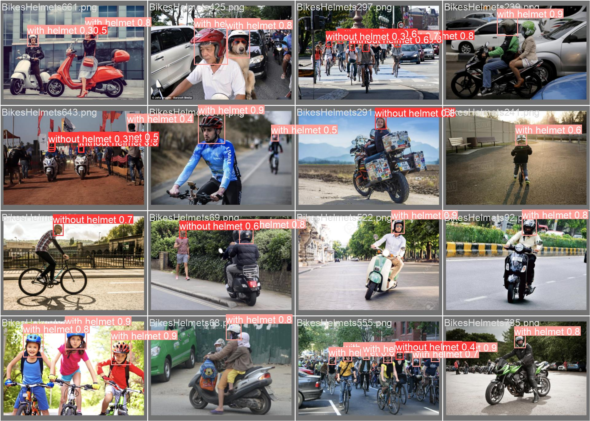

## Evaluate the model

Yolo outputs loads of graphs and metrics during the training, to help you visualize the results and assess your model's performance.  

Let's have a look at the curves first:  

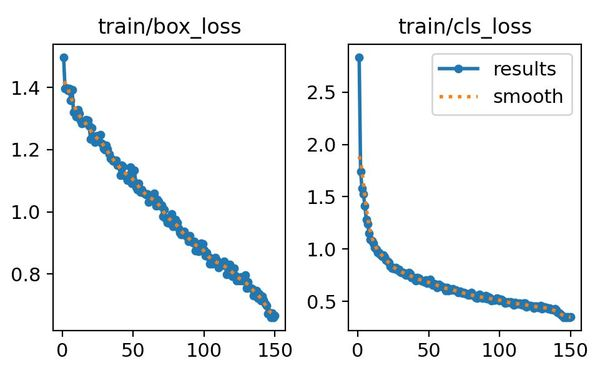

The **train/box** loss and **trail/cls** loss shows us the model's accuracy when generating the bounding boxes (left) and classifying features as with or without helmet (right). Both decrease as expected over time. We can see that our model learns the classification part pretty quickly (drop over the first 20 epochs), but it takes longer to learn how to generate accurate bounding boxes (linear drop).

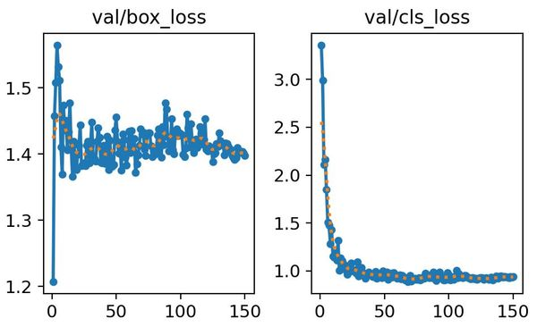

The validation loss curves (testing the model on images it has never seen during training) give us similar drops for the classification. However, the bounding box loss seems to stagnate around 1.4 and does not decrease much, I'm not sure why.

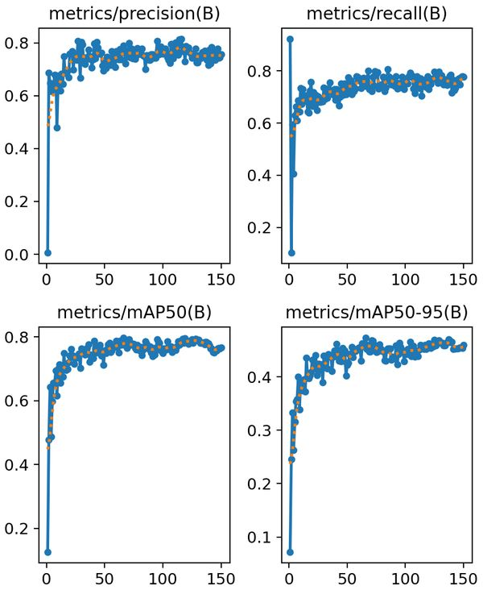

As for the other metrics like precision and recall, the curves go up and stabilize quickly.

The two bottom curves show the mean average precision at different IoU thresholds. The [Intersection over Union](https://viso.ai/computer-vision/intersection-over-union-iou/) (IoU) threshold acts as a gatekeeper, classifying predicted bounding boxes as true positives if they pass the threshold and false positives if they fall below it. By adjusting the threshold, we can control the trade-off between precision and recall.

On the left curve, the threshold is set at 50%. Higher is generally better, leading to more accurate detections. On the right curve, the mAP ranges between 50 and 95% and gives a comprehensive view of the model's performance across different levels of detection difficulty.

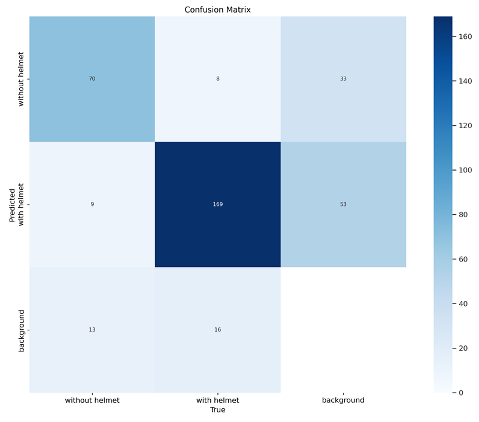

The Confusion Matrix is also a powerful graph to assess how accurate our model is at classifying heads with or without helmets, and quantifies false positives and false negatives. Our model seems to be doing a good job, predicting with accuracy if a person is wearing one or not (top left and middle squares). We have just a few false positives. It detects sometimes heads on empty backgrounds (right columnn), although this should not be too bothering for our use-case.

Note that our dataset seems to be uneven, with more features of people wearing a helmet than without (193 images Vs. 92 images here). This is confirmed on the labels graphs below. It is usually recommended to train a model on a dataset with an even distribution of images per classes.  

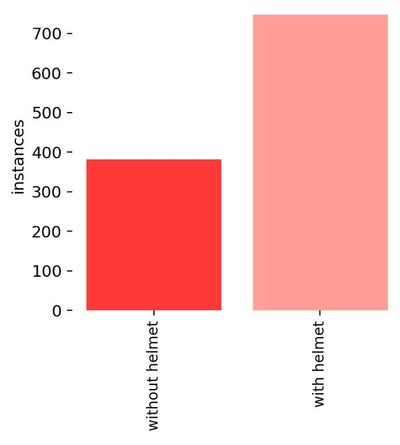


## Test the model

Now it's time to see what our model can do. Yolo will save the last and best version of it, which is not necessarely the same one. In case of EarlyStopping, you will get the best version over the amount of epochs defined as patience. 

You will find my best version in the **models** folder. 

Let's load it and predict on a few test pictures. I gathered all my tests in the **BikeHelmetDetection_Testing** notebook. A cell is running and comparing 3 predictions on the same image (COCO, OpenImageV7 and my fine-tuned model). Here are examples of how my model performs:  

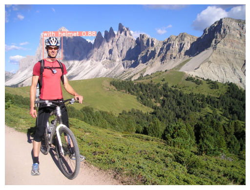
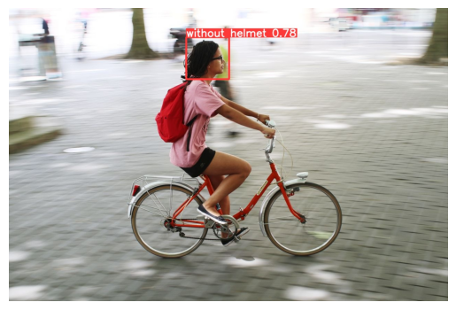   
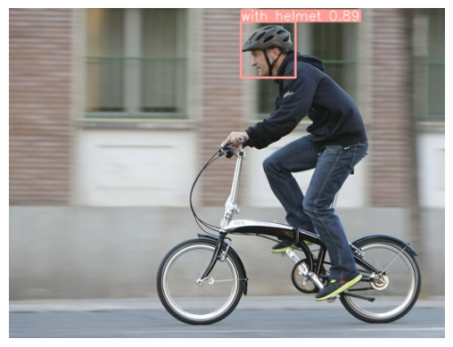   
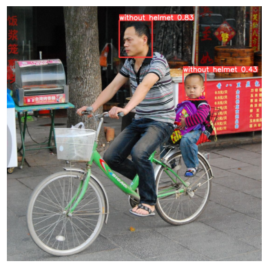   

Our model is doing a good job on images. But what about predicting on a video source, which is what we need in the end? Let's import OpenCV and give it a try on the webcam. Grab your helmet!


All good. The confidence is not as high as I would have expected, but let's move on and see if this is enough for our use-case.

# Detecting a cyclist wearing a helmet

We are now hitting the main challenge of this project:  
**How to detect a cyclist wearing a helmet?** 

As discussed in the YOLO section above, Pre-trained versions of YOLOv8 can recognize up to 1000 classes out of the box (ImageNet). But you will not find a *'Cyclist with helmet'* class, rather separate classes like *'person'*, *'bike'* or *'helmet'*. We should therefore come up with an algorithm that not only will detect these classes but will be able to tell if this person is actually sitting on a bike and if this helmet is actually on the cyclist's head. And that's not as easy as it sound!

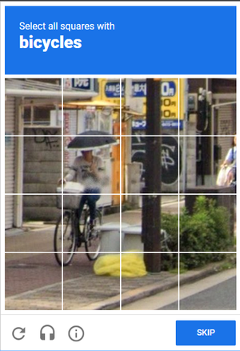  
*Are you making fun of me !?*

In the process of fine-tuning YOLOv8n to classify heads with or without helmets, we altered the output layer of our model and we lost all its pre-trained proficiency. We picked the version pre-trained on COCO, which originally could classify persons and bikes. But now it can only classify heads with or without helmets, which is not enough for our use case. We don't want a random person walking in the street to get a red frowning smiley for not wearing a helmet!

Therefore, the most flexible solution would be to combine predictions from different models on the same input image. For instance:
- YOLOv8n pre-trained on COCO  -->  Track Person and Bike
- My fine-tuned version  --> Track Helmet


We would end up with 2 or 3 bounding boxes and we can use simple maths to detect if a bounding box overlaps with another.
- Bike box inside a Person box  -->  This is a cyclist
- Helmet box inside a Person box  -->  This person wears a helmet

We can now combine both deductions and conclude if a cyclist is wearing a helmet or not.

Of course, this method will only work if a cyclist is clearly visible in the frame and detached from other background elements. If three of them are waiting closse to each others at a traffic light, bounding boxes may interfere and falsify the results. But our use-case aims at tracking and sending feedback to cyclists one at a time, so we should be fine.


# Building our final solution
We now have all the cards we need in our hand. In the **BikeHelmetDetection_Testing** notebook, I defined some helper methods that helped me parse and process the prediction results:  
- **parse_result**: extracts all info we need from a YOLO prediction results, like classes, confidence values and bounding box coordinates.
  
- **print_predictions**: prints the parsed results.
  
- **draw_result_on_frame**: draws the predicted bounding box and class label on an input frame.
  
- **get_bbox_center**: returns the center of a bounding box.
  
- **bbox_inside_bbox**: checks if a bounding box overlaps with another one. For this, I simply check if the center of the child box is inside the parent box.
  
- **combine_bboxes**: combines predicted bounding boxes (person, bike, helmet) into one (cyclist with or without helmet).
  
- **track_cyclist_with_helmet**: this is our main method processing all the predictions, splitting them in classes (person, bike, helmet) and checking if what we see is a person on a bike and if this person is wearing a helmet or not.
  
Thanks to these helpers, we can now build our OpenCV loop that will run through the video input, process each frame and draw the result on it before displaying it. 

As said, we need a way to assign our predicted classes to different models. I'm doing this with a simple assignment dictionnary, where I list each model and the classes I expect it to predict. This will undoubtedly impact our solution's performance, as we run predictions on multiple models at once, for each single frame. To help with that, I am running predictions on different threads and I combine them at the end, before sending them to **track_cyclist_with_helmet**, to process and draw the result.

https://github.com/alexdjulin/BikeHelmetDetection/assets/53292656/fd98e431-93ae-4110-8afa-fe3da5de63ed
  
_Debug flag on: The bounding boxes of the different classes are displayed in white, the combined box in red or green._

Et voilà! Our cyclists now get a green or red bounding box around them and we can display the resulting smiley as feedback.

To finish, I moved everything to **project_demo.py** and added some more settings and features, like confidence thresholds to detect the different classes, an FPS counter and debugging elements to visualise predictions.


# Conclusion and Improvements

This was intended as a short-term project. I spent two days on it to complete my module and another 4 days afterwards to come up with a clean solution. While I achieved my objective, performance remains the main issue of this project. The tracking examples displayed on this page are played in real-time, but my prediction model is running at about 7 FPS on my local computer. This is not fast enough to detect cyclists accurately and give them a real-time feedback.

To move this project towards a final solution, we should first research what device could be used to detect cyclists in the street (Raspberry Pi?), what performance it offers and how we could optimize our prediction model to run much faster.

This project has been very instructive and was a perfect conclusion to my 4-week Deep Learning bootcamp (I got the best grade!). I hope I will get the chance to work on it further in the near future and eventually see it put to good use in the streets, hopefully raising cyclists awareness and reducing casualties.

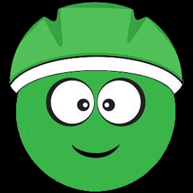   

### BE SAFE OUT THERE, WEAR A HELMET !  

